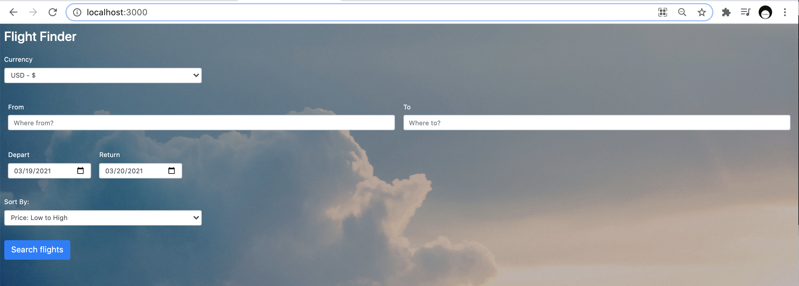
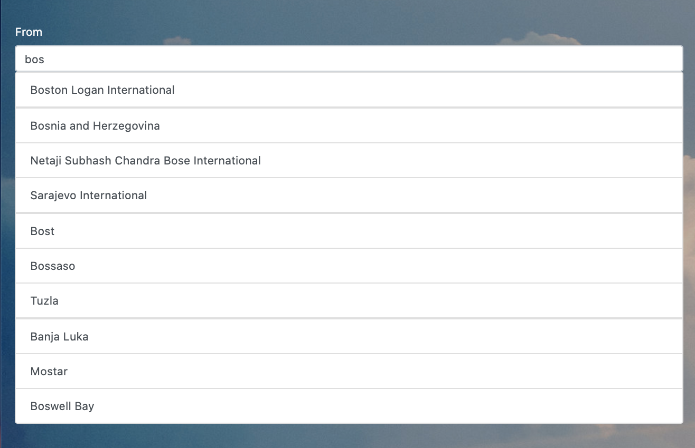
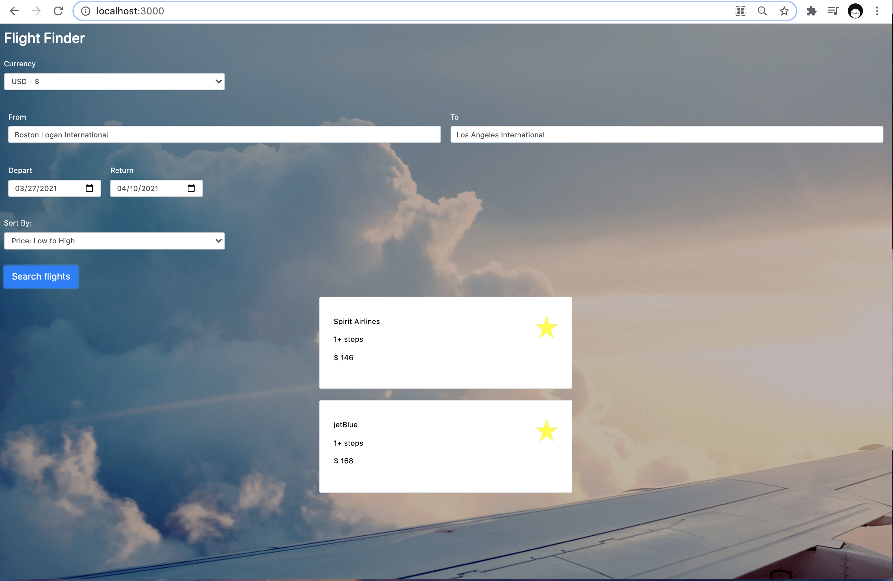

# Flight Finder 

Flight Finder is a web application that displays flight options for specific departure and return dates
and locations. This application uses the Skyscanner API to retrieve flight information. 

The user enters in search parameters such as their departure and return airports and the corresponding dates. A call is made to the Skyscanner API with these parameters, and a list of flight options is displayed to the user, highlighting the three cheapest flights. This list includes information on flight carriers, layovers, and price for each flight deal.

After the flight data is displayed, the user is able to sort the data by price in ascending and descending order.

The user can choose their desired currency to display prices in. This feature only updates after clicking the search button. 

## Technolgies Used 
* HTML (HyperText Markup Language): markup language used to create web pages. 
* CSS (Cascading Style Sheet): used to format web pages. 
* Javascript: programming language used for web page programs. 
* [JQuery](https://jquery.com/): a JavaScript library that simplifies manipulation of the DOM, 
event handlers, and Ajax calls. 
* [Bootstrap](https://getbootstrap.com/): a front-end development framework that simplifies CSS and JavaScript design for web pages. 
* [QUnit](https://qunitjs.com/): testing framework for JavaScript. 
* [Node.js](https://nodejs.org/en/): runtime environment for JavaScript. 
* [Express](https://expressjs.com/): web application framework for server building; requires Node.js.  

## Getting Started 
1. Download and install [Node.js](https://nodejs.org/en/). 
2. Clone Flight Finder using [this link](https://github.com/cmac4396/FlightFinder.git). 
3. Go to the FlightFinder folder.
4. Get all Node dependencies (use command below):
~~~
npm install
~~~
5. Start the application: 
~~~
node app.js
~~~
6. The app is now available at http://localhost:3000. 
7. To view and execute tests, go to http://localhost:3000/test.html. 

## Navigating the App
When you first open the app, the initial page allows users to search for available flights by filling out the form. The initial screen should look like this: 
 

When filling out the From and To fields, a list of suggested locations will pop up. Clicking these locations will place them into their corresponding fields. 

After clicking the search button, the results will be displayed in ascending price order. The three cheapest price options are starred. The user can also choose to sort by price in descending order using the Sort By dropdown. 

Note: Due to the limitations on the Skyscanner API, I was unable to find a result that appropriately displays starred and unstarred flight options. 

## Technical Analysis 
You can find an in-depth analysis of the application's architecture  [here](/TechAnalysis.md). 

## Resources 
### Skyscanner Flight Search API
The [Skyscanner API](https://rapidapi.com/skyscanner/api/skyscanner-flight-search) is used to retrieve flight options based on the given departure and return dates and locations. 
