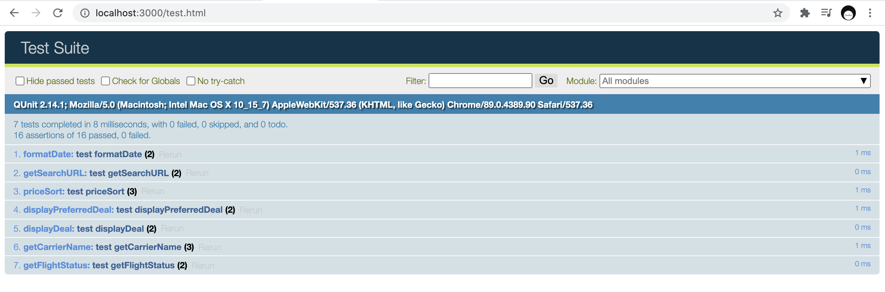

# Technical Analysis 

## Major Components 
1. UI Layout and Style
2. Events
3. Functions 

## Design Decisions
I chose JQuery as the framework for JavaScript because it is beginner-friendly and provides sufficient functionality for a single-page web application. 
 
 
Bootstrap is a style and templating framework that helps to create a standardized UI layout. 
 
 
All user events are handled by JQuery and further processed by JavaScript functions. 

## Key Features 
### Autocomplete for Airport Locations
The autocomplete feature uses events to track a user's key input to call a JavaScript function that performs an Ajax call to the Skyscanner Places API. 
 
Time Complexity: O(n) because the performance is dependent on the amount of locations returned from the input query. The performance limitation is based on the network speed to fulfill this request because the data is not available locally. 
 
 
<i> A more optimised solution could be to get the full list of places from the Skyscanner Places API when loading the application and perform the search locally, which reduces network traffic to the API. </i>

### Search
The search feature takes in parameters from the user interface and assembles a request to the Skyscanner Browse Flight Prices API. 
 
Time Complexity: Since the data is also gathered from the API, the network performance hit is incurred similarly to the autocomplete feature.  

### Sort
Sort is performed entirely local to the web application. Performance is expected to be more efficient than the autocomplete and search features. 
 
Time complexity: O(nlog(n)) for JavaScript's Array.sort(). The algorithm is similar to MergeSort or QuickSort. 

## File Structure
| File Type | Location |
|-----------|:---------|
|HTML       | public   |
|CSS        | public/css |
| JavaScript | public/js |
| QUnit Tests | public/js/test |
 

## Tests
Unit tests are written using the QUnit JavaScript testing framework. Opening [test.html](public/test.html) invokes all the tests and displays the test results to the screen: 

All individual test cases are written to [test-functions.js](public/js/test/test-functions.js). 